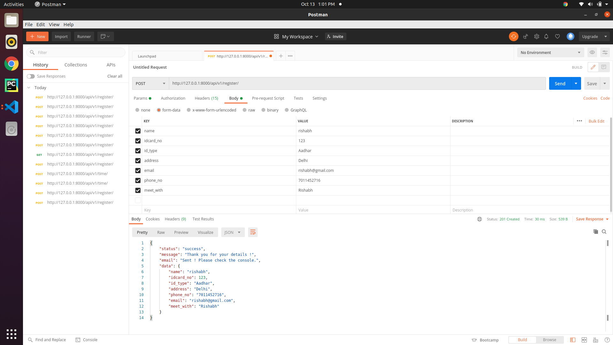
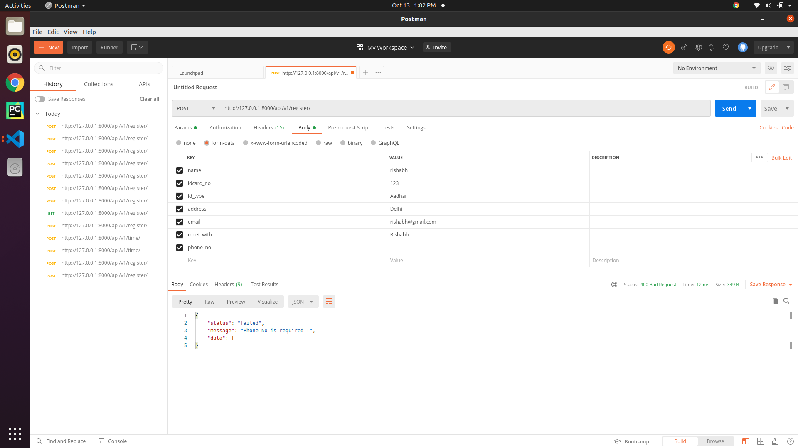
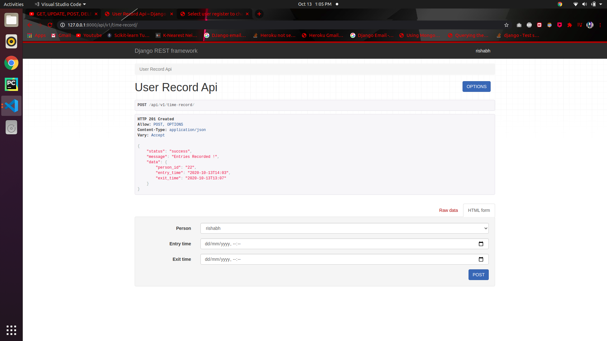

# task-2-drf
PROJECT FOLDER : **mysite

App : **myuserapp

Database Used : **db.sqlite3

Features Listed In The App :

● User Registerations

● Staff recording users entry & exit time in office.

**1. User Registeration REST API Endpoint :

http://127.0.0.1:8000/api/v1/register/

> Some validations checks : 

**2. User Entry & Exit Time Record REST API Endpoint :

http://127.0.0.1:8000/api/v1/time-record/

How to get the app running locally ?

**For Linux : RUN > pip3 install -r requirements.txt & python3 manage.py runserver

**For Windows : RUN > pip install -r requirements.txt & python manage.py runserver

How to check entries in database ?

Run  **python3 manage.py createsuperuser

Please create a dummy superuser and check the details in the admin panel by going on the link :

 http://127.0.0.1:8000/admin/
